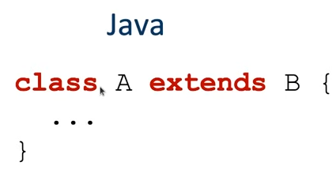
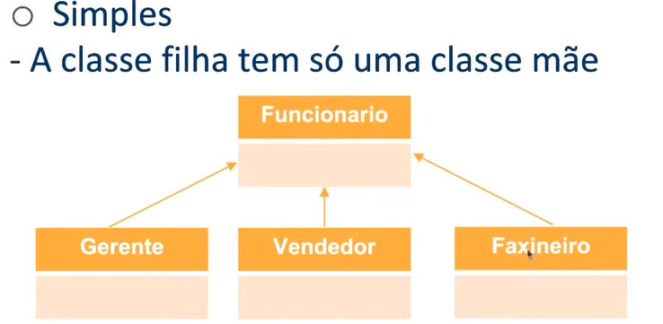
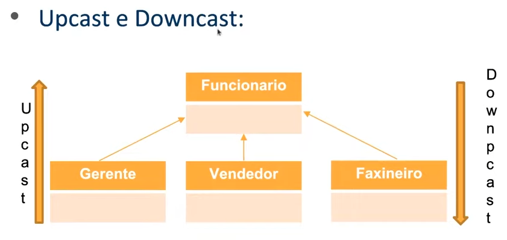
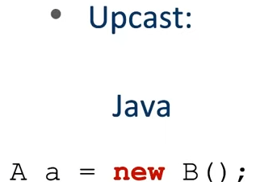
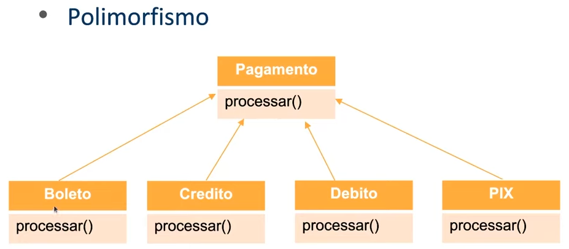

# herenca, associação e interface
## herenca
A = Subtipo(Classe Filha) de B 
B = Superclass //Classe mais genérica
 
Em java:

  Upcast Muito útil  

  Pouco usual Downcast(Cuidado ao usar):  

### Polimorfismo: 

